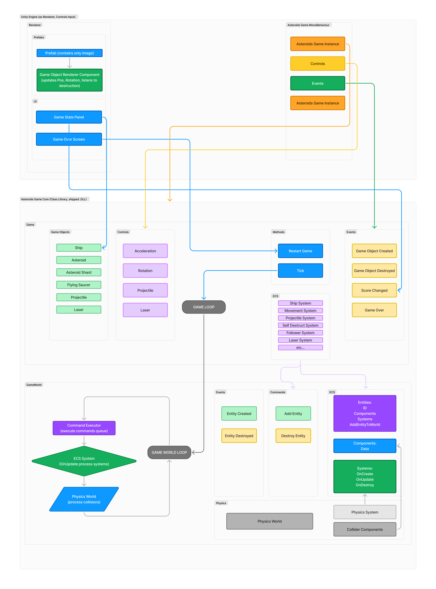

## Asteroids Game Sample

This sample utilizes separately built game core with simple ECS system and bare-bones physics world.

Game Core can run everywhere C# is supported via .dll inclusion.

Meaning it can run on backend or any game engine that can import/link game core .dll

.NET Standard 2.1

C# 9.0

## Diagram how everything works.

## Usage

1) Open Unity project (~2022.3.33f1) in AsteroidsClient folder

2) If you do not have library linked in Assets/Vendor - open AsteroidsCore project in Visual Studio or built manually via dotnet cli command.

3) Start the game: arrows to rotate, accelerate, spacebar for projectile and left control for laser